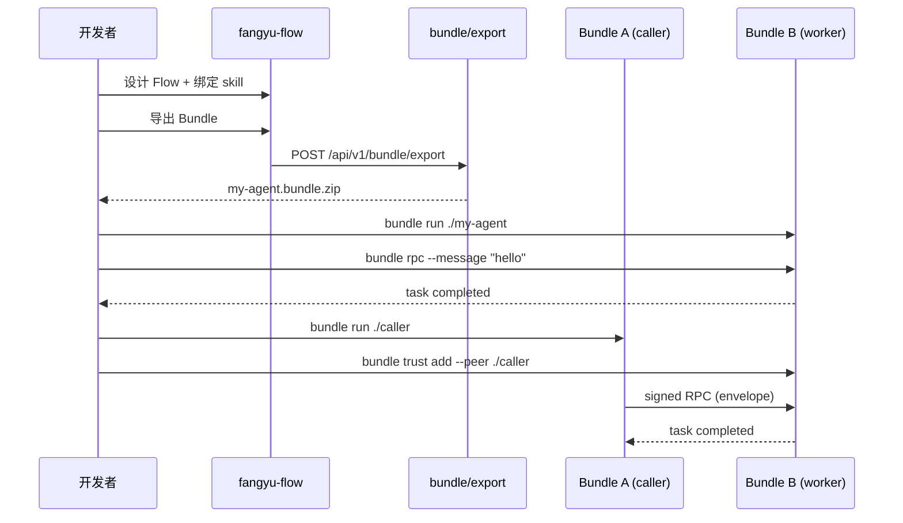

# Phase 5 技术方案 — 开发者基础设施

> **受众：** 集成商 / 后端工程师。目标：1 小时内完成 Bundle 导出 → 独立运行 → 远程加密 RPC。

关联：[安全模型 v1](SECURITY_MODEL.md) · [L1 主线](L1_ROADMAP.md) · [用户手册](USER_GUIDE.md)

---

## 1. 目标与验收

### 1.1 北极星

把 L0–L1 做成**可依赖、可集成、可交付**的 infra：

```
Flow/Agent 画布 → 导出 Bundle → run-bundle (daemon) → 本地/跨机 A2A RPC → 外部 Agent 联邦
```

### 1.2 验收标准

| # | 标准 |
|---|------|
| A | 新工程师按文档 **≤5 步、无手改 JSON** 跑通 Happy Path |
| B | `py -3 scripts/happy_path_demo.py` 全绿（含跨 Bundle 加密 RPC） |
| C | Bundle 以 **daemon** 常驻，A2A 触发即执行 skill subgraph |
| D | 外部 Agent：粘贴 RPC URL → 发现 → 一键授权 |
| E | CLI 统一：`fangyu bundle run|rpc|validate|trust` |

---

## 2. 架构总览

```
┌─────────────────────────────────────────────────────────────────────┐
│ 设计期（fangyu 平台）                                                 │
│  Flow 画布 ──bind──► Agent.skillFlows                                │
│  Agent 画布 ──export──► POST /api/v1/bundle/export → .bundle.zip     │
└───────────────────────────────┬─────────────────────────────────────┘
                                │ unzip
┌───────────────────────────────▼─────────────────────────────────────┐
│ 运行期（Standalone Bundle Runtime）                                   │
│  py -m fangyu bundle run ./agent [--port 9001] [--daemon]            │
│    ├─ FastAPI: /health /card /identity/public /rpc                   │
│    ├─ AgentRegistry + AgentBus（单 Agent 内嵌）                       │
│    ├─ skill flow → scheduler.run_flow（A2A 触发）                     │
│    └─ TrustRegistry ← trusted_peers + envelope 验签                   │
└───────────────────────────────┬─────────────────────────────────────┘
                                │ X-A2A-Envelope + JSON-RPC
                                ▼
                    其他 Bundle / 平台 / 外部 Agent
```

### 2.1 与 Phase 1–4 的关系

| 已有模块 | Phase 5 增强 |
|----------|--------------|
| `core/agent_bundle.py` | `add_trusted_peer()`、`get_run_instructions()` |
| `engine/bundle_runtime.py` | `/identity/public`、daemon 状态、启动指引 |
| `engine/bundle_a2a_client.py` | CLI `bundle rpc` 封装 |
| `routers/a2a.py` discover | 返回 `agent_id` + `public_key` |
| `scripts/bundle_demo.py` | 扩展为 `happy_path_demo.py`（跨机信封） |
| 前端 export | 导出后展示运行命令面板 |

**不新建平行 runtime**，在现有 Bundle server 上增量扩展。

---

## 3. Happy Path 设计

### 3.1 五步流程

| 步 | 动作 | 实现 |
|----|------|------|
| 1 | Flow 设计 action skill 并绑定 Agent | 画布已有 |
| 2 | 导出 `.bundle.zip` | `downloadAgentBundle()` / API |
| 3 | 解压并 `bundle run` | CLI + `start.bat/sh` |
| 4 | 本机 `bundle rpc` 调 skill | `bundle_a2a_client` + CLI |
| 5 | 第二 Bundle 加密跨调 | `add_trusted_peer` + signed RPC |

### 3.2 序列图



### 3.3 消除手改 JSON 的关键

| 痛点 | 方案 |
|------|------|
| 互设 trusted_peers | `add_trusted_peer(bundle_dir, agent_id, public_key)` |
| 获取对端公钥 | `GET /identity/public` 或 discover API |
| 签名 RPC | `rpc_call()` / `fangyu bundle rpc` |
| 运行命令 | 导出 API 响应头 / 前端 Runbook 面板 |

---

## 4. Daemon 长运行 Worker

### 4.1 语义

Bundle runtime **本身就是 daemon**：`uvicorn` 常驻，等待 A2A RPC 触发 skill 执行。

Phase 5 明确化：

- CLI 增加 `--daemon`（等价于默认 run，输出更清晰的状态）
- `GET /health` 返回 `mode: "daemon"`、`uptime_sec`、累计 task 数
- 后续（Phase 5.2）：Adapter 事件 → 触发 skill（MQTT subscribe）

### 4.2 状态机

```
[启动] → listening
  └─ A2A RPC a2a.send_message → working → completed/failed → listening
```

无需额外进程；与 OpenClaw「常驻等任务」模型对齐。

### 4.3 代码落点

```
engine/bundle_runtime.py   # DaemonState + health 扩展
engine/bundle_daemon.py    # 轻量状态追踪（uptime、task 计数）
__main__.py                # bundle run --daemon
```

---

## 5. CLI 统一设计

### 5.1 命令结构

```bash
py -m fangyu bundle run <dir> [--host] [--port] [--daemon]
py -m fangyu bundle rpc <dir> --url <rpc> --message "..." [--skill default]
py -m fangyu bundle validate <dir>
py -m fangyu bundle trust add <dir> --from <peer-bundle-dir>
```

### 5.2 兼容

保留 `--run-bundle` 作为 `bundle run` 别名，不破坏现有脚本。

### 5.3 模块

```
engine/bundle_cli.py   # argparse 子命令实现
__main__.py            # 路由到 bundle_cli
```

---

## 6. 外部 Agent Onboarding

### 6.1 增强 discover

`POST /api/v1/a2a/agents/discover` 响应扩展：

```json
{
  "rpc_url": "http://host:9001/rpc",
  "card": { ... },
  "identity": {
    "agent_id": "fyu:agent:...",
    "public_key": "<hex>"
  }
}
```

实现：先 `GET {base}/identity/public`，fallback `GET /health`。

### 6.2 前端 UX

- 「发现远程 AgentCard」→ 自动填充 agentId、publicKey
- 信任徽章：authorized / 未授权
- 一键授权 checkbox（已有，增强提示）

---

## 7. API 变更摘要

| 端点 | 变更 |
|------|------|
| `GET /health` (bundle) | +`public_key`, +`mode`, +`uptime_sec`, +`tasks_total` |
| `GET /identity/public` (bundle) | **新增** — agent_id, public_key, require_envelope |
| `POST /a2a/agents/discover` | +`identity` 字段 |
| `POST /api/v1/bundle/export` | 响应可选 `X-Fangyu-Run-Instructions`（后续） |

---

## 8. 文件变更清单

| 文件 | 类型 |
|------|------|
| `docs/PHASE5_TECH_SPEC.md` | 本文档 |
| `docs/SECURITY_MODEL.md` | 安全拍板 |
| `core/agent_bundle.py` | add_trusted_peer, get_public_identity |
| `engine/bundle_daemon.py` | **新** — DaemonState |
| `engine/bundle_runtime.py` | identity 端点、daemon 集成 |
| `engine/bundle_cli.py` | **新** — CLI 子命令 |
| `engine/a2a_remote.py` | fetch_remote_identity |
| `routers/a2a.py` | discover 增强 |
| `scripts/happy_path_demo.py` | **新** — E2E 演示 |
| `__main__.py` | bundle 子命令路由 |
| `fangyu-flow/.../exportAgentBundle.ts` | Runbook 类型 |
| `fangyu-flow/.../AgentCanvas.tsx` | 导出后指引面板 |
| `fangyu-flow/.../AgentConfigPanel.tsx` | discover 自动填身份 |
| `tests/integration/test_happy_path.py` | **新** |
| `tests/unit/test_bundle_cli.py` | **新** |

---

## 9. 测试计划

| 测试 | 覆盖 |
|------|------|
| `test_happy_path.py` | 创建双 bundle → trust → signed RPC |
| `test_bundle_cli.py` | validate / trust add |
| `test_bundle_runtime.py` | /identity/public、health 字段 |
| `test_a2a_discover.py` | discover 返回 identity |
| `scripts/happy_path_demo.py` | 人工/CI  smoke |

---

## 10. 后续（Phase 5.2，不在本次范围）

- 真实 MQTT adapter（替换 mqtt_sim）
- 私钥环境变量注入 `FANGYU_AGENT_PRIVATE_KEY`
- 持久化 CRL / anchor 同步
- `bundle export` CLI（无 UI 纯命令行导出）
- OpenAPI SDK 生成

---

## 11. 6–8 周节奏建议

| 周 | 交付 |
|----|------|
| W1 | 本文档 + SECURITY_MODEL + Happy Path 脚本全绿 |
| W2 | CLI 统一 + 前端 Runbook + discover 增强 |
| W3–4 | Daemon 指标 + Adapter 事件触发 prototype |
| W5 | 真实 MQTT adapter |
| W6–8 | 集成 cookbook + 外部 DX 示例 + Phase 5 验收 |

---

*版本：phase5-tech/1.0 — 与代码实现同步*
